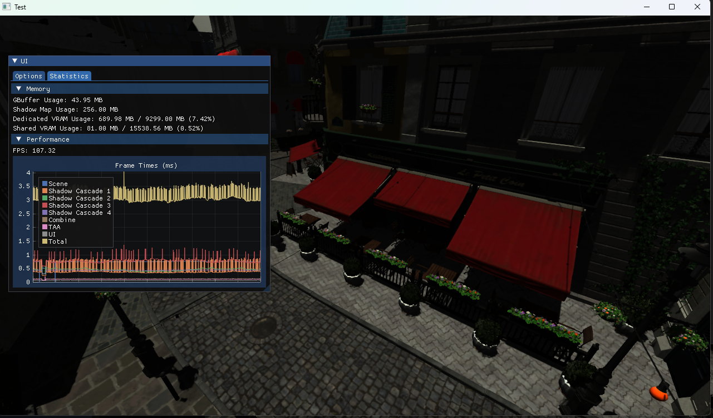

# YetAnotherRenderSandbox

This codebase serves as an on-going hobby project to familiarise myself with some modern C++ paradigms as well as some low-level Vulkan concepts.

The project consists of a Windows-specific solution file with dependencies pre-compiled with AVX2 as a pre-requisite which may render some hardware configurations unable to compile this codebase.

The current focus is on building up a fairly solid foundation, with graphical fidelity not being the immediate goal which will result in some sub-par output. Currently a hard-coded directional light spins around an arbitrary GLTF file (with the assumption it contains PBR data.)

Some short-term goals I'll be looking at:
* Compute-based culling.
* Experimenting with some different lighting setups.
* Experimenting with basic animation.

