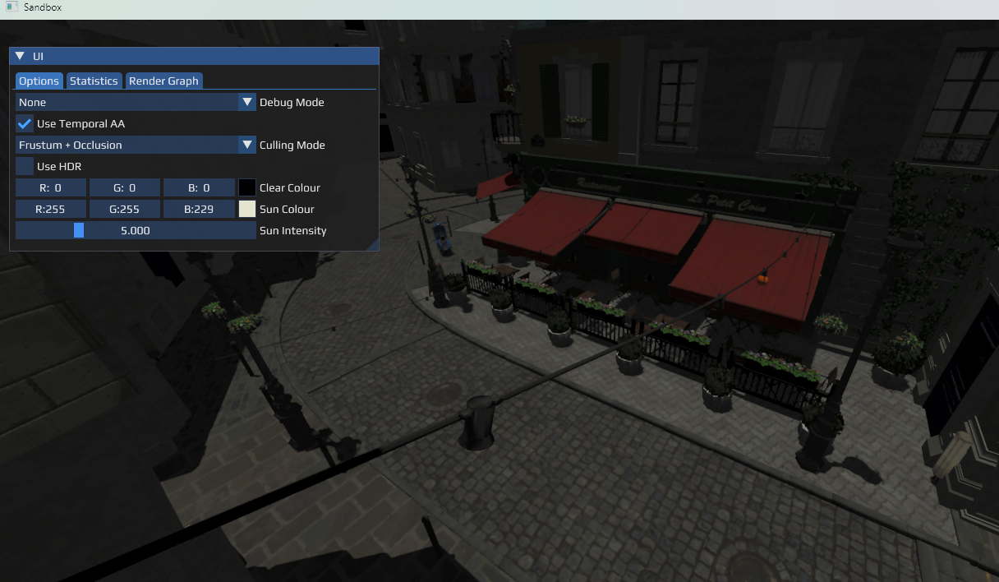
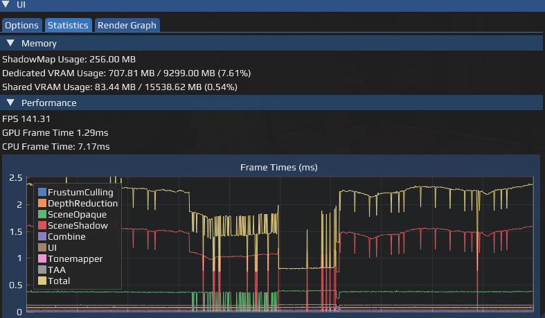
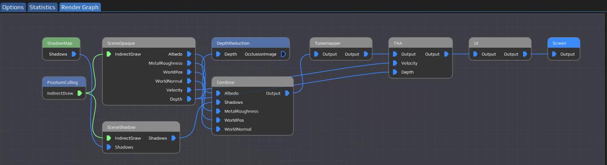

# YetAnotherRenderSandbox

This codebase serves as an on-going hobby project to familiarise myself with some modern C++ paradigms as well as some low-level Vulkan concepts.

The project uses CMake as the build system - Currently only Windows is supported. All required dependencies are linked as Git submodules with the exception of a level asset which is downloaded as part of the CMake configure step.

The current focus is on building up a fairly solid foundation, with graphical fidelity not being the immediate goal which will result in some sub-par output. Currently a hard-coded directional light spins around an arbitrary GLTF file (with the assumption it contains PBR data.)

## Current features:
* Render graph system that manages dependencies between render passes and management of shared buffer and texture resources.
* Integration with [ImGui](https://github.com/ocornut/imgui) UI system.
* Asset import pipeline to convert GLTF data to BC5 & BC7 textures & optimised mesh data.
* FXAA, SMAA and TAA anti-aliasing options.
* Cache system for rapid asset loading after initial processing, currently LZ4 compressed on disk.
* Fairly simple cascaded shadow mapping - Uses depth clamp to avoid noticeable artifacts, though there's currently no cascade blending.
* HDR display output support.
* GPU-based frustum culling.
* Hi-Z GPU-based occlusion culling.

## Screenshots
### Options & Rendering

### Frame statistics

### Render graph

## Some short-term goals I'll be looking at:
* Add a sky - some sort of atmosphere shader would be cool!
* Implement image-based lighting
* Revisit shadow culling - experiencing some issue where per-cascade frustum culling is too aggressive and surprisingly not really helping performance.
* Considering adding some upscalers (DLSS, FSR & XeSS).
* Give synchronisation and render graph a once-over.
	* Verify multiple-frames-in-flight is consistent and not being blocked by any singular buffer usages.
	* Currently there's no synchronisation validation errors, but would like to avoid creating messy, error-prone architecture.
	* Some simple sanity checks that applies even without Vulkan validation would be good.

## Wishlist:
* Experimenting with basic animation.
* Get a basic transparency pass in.
	* Probably need a different test scene to display too.
* HDR improvements
	* Add some form of calibration - there's no 'nits' input right now.
	* Render UI to a regular SDR sRGB texture - currently it looks too bright and wrong.
* Handle asset streaming - currently everything is loaded into a few big buffers with no cheap way to load new data in.
* Possibly investigate replacing LZ4 compression with 'DirectStorage-like' GPU decompression during loading
* Look at raytracing and/or mesh shaders - the latter is probably more practical at this stage